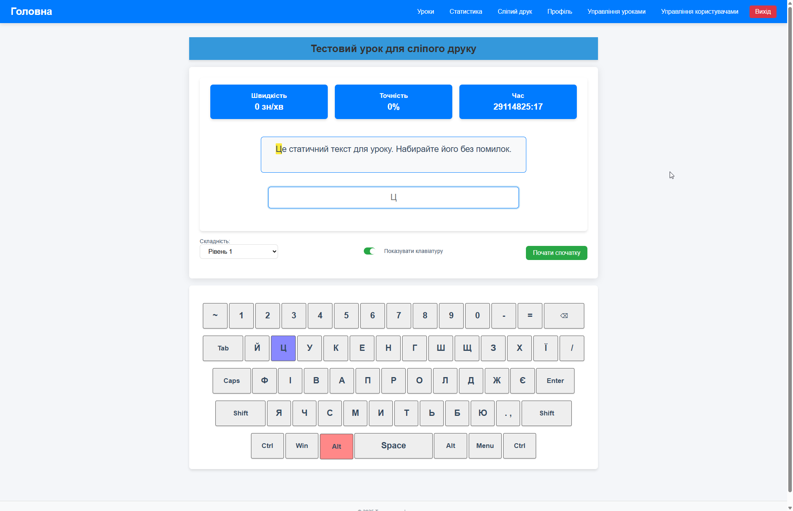

# Blind Typing Trainer

Репозиторій містить веб-додаток “Тренажер сліпого друку” на PHP + MVC.  
Мета — навчити користувача друкувати без погляду на клавіатуру, відстежити швидкість (WPM), точність (%) та час.



---

## 🚀 Функціональність

- **Три режими складності**  
  1. Показує всю клавіатуру + синій підсвіт наступної клавіші.  
  2. Показує всю клавіатуру + підсвіт натиснутих (зелений/червоний).  
  3. Показує всю клавіатуру + підсвіт натиснутих, зверху — лише наступний символ у placeholder.  

- **Три сторінки**  
  - **Головна** (`/`) — тренажер (випадковий тест, якщо не вибрано урок).  
  - **Уроки** (`/lessons`) — вибір одного з уроків (ao, vl, …, цифри).  
  - **Статистика** (`/stats`) — ваша історія + загальна статистика всіх користувачів.

- **Вимірювання показників**  
  - WPM (зн/хв),  
  - Точність (%),  
  - Загальний час.

- **Сесії та збереження**  
  - Авторизація і реєстрація користувачів,  
  - Збереження результатів у MySQL (таблиця `stats`),  
  - AJAX-запит для фонової відправки даних.

---

## 🛠️ Встановлення

1. **Клонування**
   
    ```powershell
   git clone https://github.com/yourname/BlindTypingTrainer.git
   cd BlindTypingTrainer
    ```
2. **Composer**

    ```powershell
    composer install
    ```

3. **Налаштування .env**

- Скопіювати .env.example → .env

- Вказати параметри БД:
```
makefile
Копіювати
Редагувати
DB_DRIVER=mysql
DB_HOST=127.0.0.1
DB_PORT=3306
DB_DATABASE=blind_trainer
DB_USERNAME=root
DB_PASSWORD=
```

4. **Імпорт схеми БД**

```bash
mysql -u root -p blind_trainer < database/schema.sql
```

5. **VirtualHost (WAMP / Apache)**

- DocumentRoot → …/BlindTypingTrainer/public

- AllowOverride All, DirectoryIndex index.php

- Перезапустити сервер

6. **Запуск**

- Відкрити в браузері:

```bash
http://localhost/BlindTypingTrainer/public
```
або

```bash
http://trainer.local
```

## ⚙️ Використання
1. Зареєструватися або увійти.

2. Перейти до “Уроки” → обрати набір символів → “Почати обраний урок”.

3. На головній: тренуватися, слідкувати за підсвічуванням і показниками.

4. Після завершення реального уроку результати автоматично зберігаються.

5. “Статистика” — перегляд власних та загальних результатів.

## 📐 Programming Principles
У проекті дотримані мінімум 5 принципів:

1. SRP (Single Responsibility) – кожен клас виконує єдину відповідальність.

2. DRY (Don’t Repeat Yourself) – уникнення дублювання коду (BaseController, Database).

3. KISS (Keep It Simple, Stupid) – мінімальна складність, зрозуміла архітектура.

4. YAGNI (You Aren’t Gonna Need It) – реалізовано тільки необхідний функціонал.

5. Encapsulation – приховано внутрішню реалізацію (PDO-з’єднання, роутинг).

## 🧱 Design Patterns
1. Singleton — App\Core\Database (єдине PDO-з’єднання).

   - Файл: app/Core/Database.php

2. Factory / Repository — Lesson::all(), Lesson::getById() отримують моделі з БД.

   - Файл: app/Models/Lesson.php

3. Front Controller — public/index.php маршрутизує всі запити через App\Core\Router.

   - Файл: public/index.php

4. MVC — чіткий поділ на Models, Views, Controllers.

## 🔧 Refactoring Techniques
1. Extract Method — виділення логіки рендерингу в окремі методи (renderText(), updateStats()).

2. Extract Class — рознесення ядра (Router, BaseController, Database) в окремі класи.

3. Remove Dead Code — очищено від непотрібних функцій і змінних.

4. Simplify Conditional — у JS-обробниках клавіш мінімізовано вкладені if.

5. Replace Magic Number — всі “магічні” константи (розміри клавіш, таймери) винесені в змінні та CSS.

Автор: Грушевицький Денис · ЛР №6 · 2025